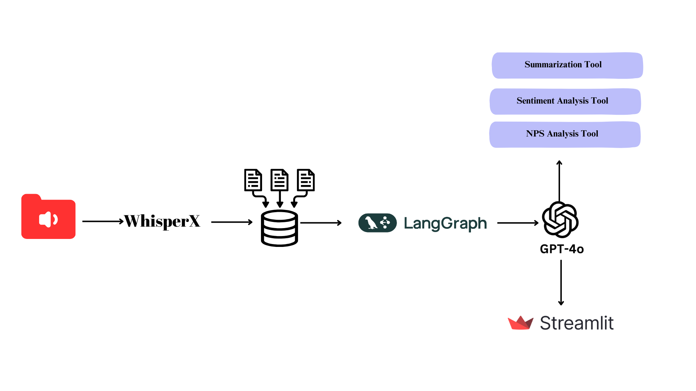
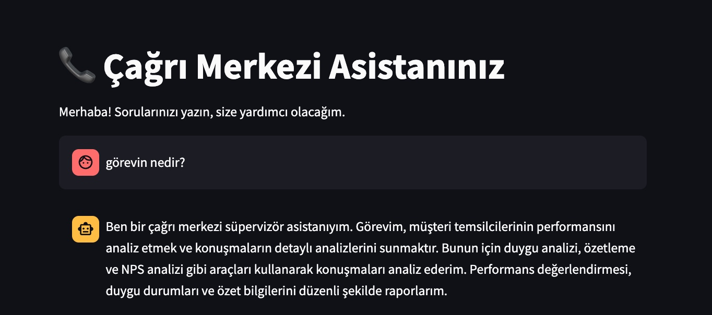
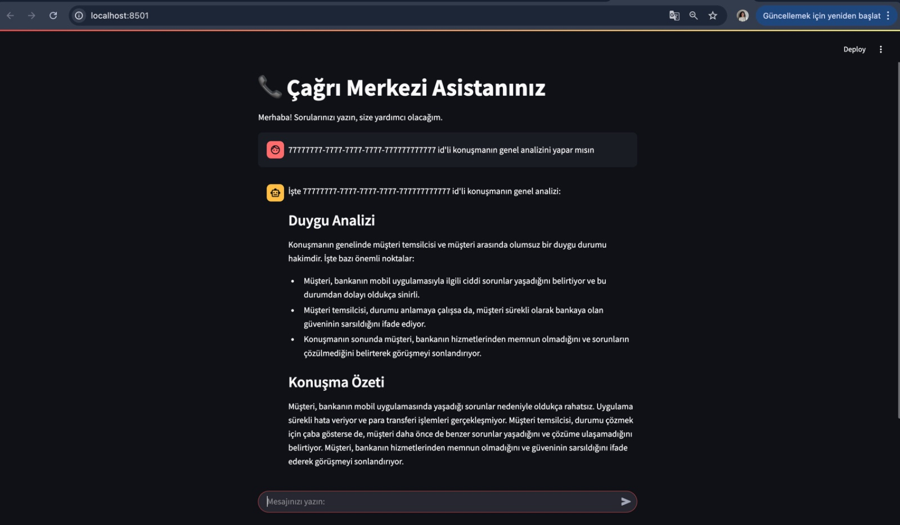
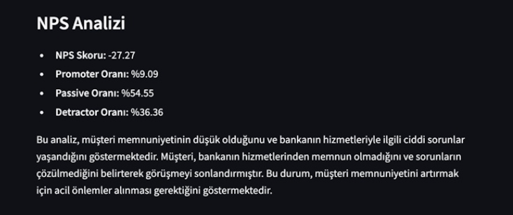
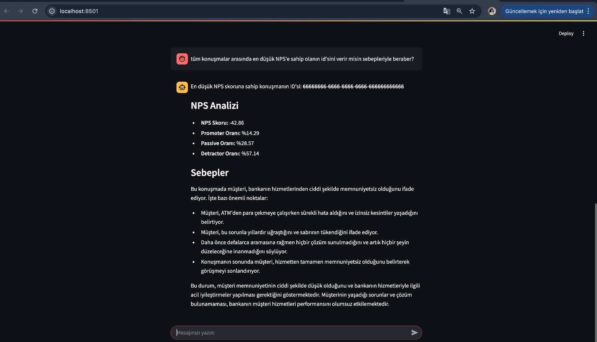
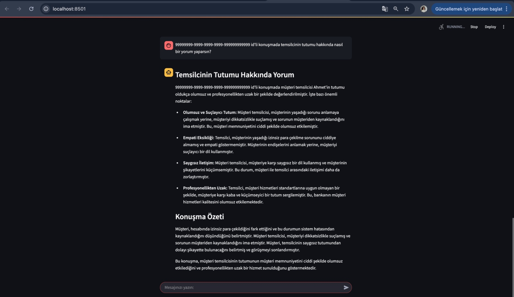

# DIGITAL ASSISTANT FOR CALL CENTERS

## Overview
This project is an AI-powered digital assistant designed to analyze customer service calls. The assistant processes structured text data and applies three key analytical tools using LangGraph and GPT-4o:

- NPS Analysis: Evaluates customer loyalty and satisfaction.

- Sentiment Analysis: Assesses the emotional tone of conversations.

- Summarization: Generates concise summaries of customer interactions.

## Technologies Used

- Speech-to-Text & Diarization: WhisperX (Pre-Processing Step)

- Database: MySQL

- AI & NLP Models: GPT-4o, RoBERTa-based Zero-Shot Classification, BERT for Sentiment Analysis, mT5 for Summarization

- Frameworks & Libraries: LangGraph, Transformers, Streamlit

## Architecture

### 1. Dataset Preperation 
- Customer service calls are recorded in audio format.

- WhisperX performs diarization and converts speech to text.

- The processed text is stored in JSON format.

### 2. Data Storage
- Conversations in JSON format are stored in a database.

- MySQL is used to store structured conversation data with unique IDs.

### 3. Data Processing & Analysis
LangGraph creates a workflow that processes structured text data using GPT-4o.

**Three AI-based tools analyze the conversations:** 

- NPS Analysis: Categorizes customers into Promoter, Passive, and Detractor groups.Predicts and evaluates customer loyalty and satisfaction.​

- Sentiment Analysis: Identifies whether customer feedback is positive, neutral, or negative.

- Summarization: Extracts key points from the conversation to generate a summary.

### 4. Dashboard

- Chat UI created with Streamlit 

ß

## References

1. **Sentiment Analysis Model:** [BERT-base Turkish Sentiment](https://huggingface.co/savasy/bert-base-turkish-sentiment-cased)

    - Yildirim, Savas. Fine-tuning Transformer-based Encoder for Turkish Language Understanding Tasks. arXiv preprint (2024). arXiv:2401.17396

    - Yildirim, Savas & Asgari-Chenaghlu, Meysam. Mastering Transformers: Build state-of-the-art models from scratch with advanced natural language processing techniques. Packt Publishing Ltd, 2021.

2. **NPS Analysis Model**: [XLM-RoBERTa Large XNLI ](https://huggingface.co/joeddav/xlm-roberta-large-xnli) 

3. **Summarization Model**: [mT5 Small Turkish Summarization ](https://huggingface.co/ozcangundes/mt5-small-turkish-summarization)

